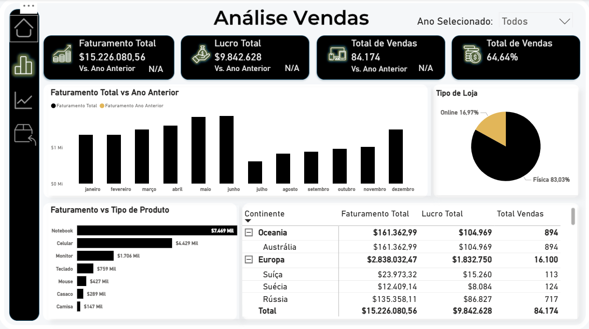

# 📊 Dashboard de Análise de Dados

🔗 **Acesse o dashboard:** 

https://app.powerbi.com/view?r=eyJrIjoiY2U3NjQ4NmItMTdmZC00ZDYzLWI4YWYtZGRlZjhkNzY4ZTc4IiwidCI6IjE0Y2JkNWE3LWVjOTQtNDZiYS1iMzE0LWNjMGZjOTcyYTE2MSIsImMiOjh9

## 🔎 Objetivo
Dashboard desenvolvido para análise de indicadores e apoio à tomada de decisão,
com foco em visão gerencial e administrativa.

## 🛠️ Ferramentas utilizadas
- Power BI 
- Excel 

## 📈 Principais indicadores
- Faturamento
- Evolução temporal
- Comparativo por categoria
- KPIs operacionais
- Tooltips

## 🖼️ Visão do Dashboard

## 📊 Indicadores

## 🔄 Devoluções

## 📂 Dados
Este projeto utiliza dados fictícios, criados para fins educacionais, com foco no desenvolvimento e aprimoramento das minhas competências em Business Intelligence (BI), análise de dados e suporte à tomada de decisão.

