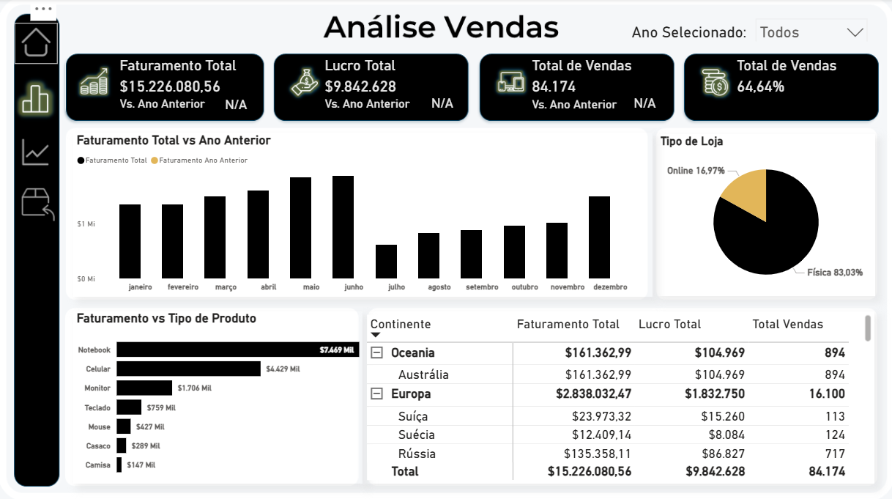
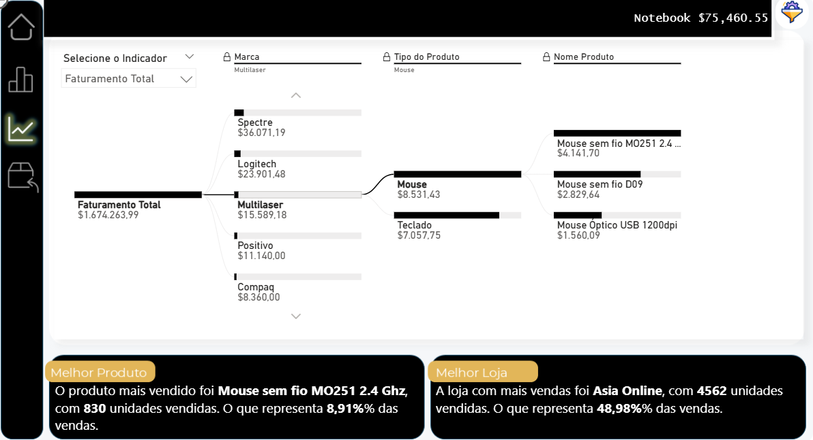
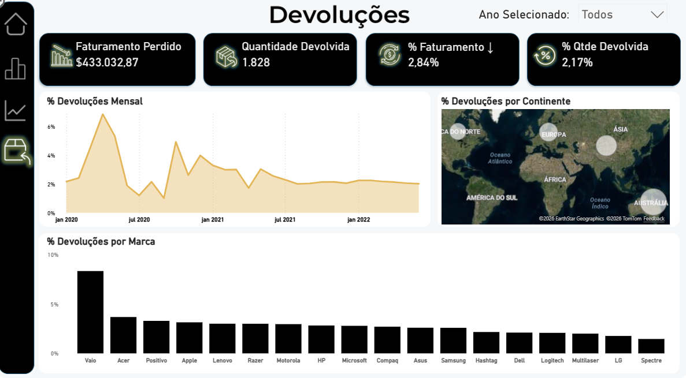

# 📊 Dashboard de Inteligência de Vendas & Performance Comercial

Este projeto apresenta uma solução completa de Business Intelligence (BI) voltada para a análise de performance comercial, monitoramento de eficiência operacional e controle de qualidade (devoluções). O objetivo principal é transformar dados brutos em um ecossistema visual que apoia o **Planejamento Estratégico** e a **Tomada de Decisão** gerencial.

🔗 **Acesse o Dashboard Interativo:** [Clique aqui para navegar no Power BI](https://app.powerbi.com/view?r=eyJrIjoiY2U3NjQ4NmItMTdmZC00ZDYzLWI4YWYtZGRlZjhkNzY4ZTc4IiwidCI6IjE0Y2JkNWE3LWVjOTQtNDZiYS1iMzE0LWNjMGZjOTcyYTE2MSIsImMiOjh9)

---

## 🔎 Arquitetura do Dashboard (Abas Estratégicas)

O relatório foi estruturado em 3 visões complementares para atender diferentes níveis de análise (do macro ao micro):

### 1. Visão Geral de Vendas (`vendas_geral`)
Focada na saúde financeira do negócio e volumetria.
* **Métricas Centrais:** Faturamento Total, Quantidade de Pedidos e Margem Comercial.
* **Análise Temporal:** Gráficos de evolução para identificar sazonalidade e tendências de crescimento ao longo dos meses.
* **Análise de Portfólio:** Visão de faturamento distribuída por categorias e subcategorias de produtos.

### 2. Indicadores Avançados e Filtros Operacionais (`indicador`)
Desenvolvida para permitir que gestores explorem os dados de forma granular.
* **Filtros Dinâmicos:** Segmentação por ano, mês, região e gerentes de conta.
* **Experiência do Usuário (UX/UI):** Implementação de **Tooltips Avançados**, permitindo que o usuário passe o mouse sobre um elemento e veja um detalhamento analítico sem precisar mudar de tela.

### 3. Análise de Qualidade e Logística (`devolucao`)
Uma visão dedicada à eficiência operacional e satisfação do cliente.
* **Métricas de Atrito:** Monitoramento rigoroso do índice e volume de devoluções.
* **Causa Raiz:** Identificação de quais produtos, categorias ou regiões apresentam maior taxa de incidentes, permitindo ações preventivas de controle de qualidade e logística.

---

## 🛠️ Competências Técnicas Aplicadas

* **Modelagem de Dados:** Estruturação de dados relacionais e tabelas dimensão/fato provenientes do Excel.
* **Fórmulas DAX:** Criação de medidas calculadas para faturamento, metas, taxas de conversão e acumulados temporais.
* **Design de Dashboards (Data Storytelling):** Layout focado em legibilidade (Dark Mode), hierarquia visual e navegação fluida.

---

## 🖼️ Interface do Projeto

### 🟦 Visão Geral de Vendas

### 📈 Indicadores Operacionais

### 🔄 Controle de Devoluções

---

## 📂 Contexto dos Dados
Este projeto utiliza uma base de dados simulada com foco educacional. O cenário foi desenhado para simular os desafios reais enfrentados por analistas de BI no mercado corporativo, exercitando a capacidade de traduzir dados em direcionamentos estratégicos.
